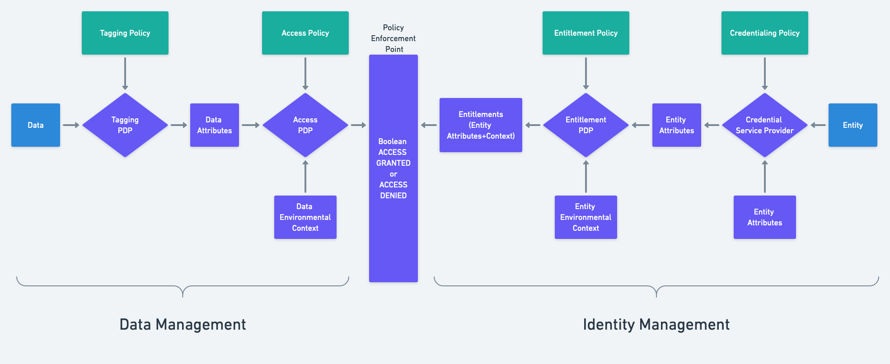

# entitlement-pdp

Repo for Entitlement Policy Decision Point (PDP) service

What's an Entitlement PDP?



## Modifying/Building/Publishing Entitlement Policy Logic

See [entitlement-policy](entitlement-policy/README.md) subfolder

### Entitlement PDP Rego entrypoint

The example Rego policy bundle in [entitlement-policy](entitlement-policy/README.md) emulates basic OpenTDF entitlement functionality.

However, the example Rego policy bundle can be replaced entirely without changing `entitlement-pdp` code itself,
as long as the following is also true of the Rego policy bundle it is replaced with:

1. The Rego policy bundle has a `opentdf.entitlement` package.
2. The `opentdf.entitlement` package has a rule named `generated_entitlements`
3. `generated_entitlements` evaluates to an array of objects in the following schema:

```json
[
  {
    "entity_identifier": "xxx",
    "entity_attributes": [
      {
        "attribute": "xx",
        "displayName": "xx"
      }
    ]
  }
]
```

### Where Rego policy bundles are stored

This service expects a valid [OPA config file](https://www.openpolicyagent.org/docs/latest/configuration/) to exist at the path pointed to by `OPA_CONFIG_PATH`. That config file will "tell" the OPA runtime embedded within this service where to load the policy bundle from.

The standard OPA approach is to store policy bundles remotely, e.g. in an OCI artifact registry (preferred), or e.g. S3, and regularly check the remote policy store for updated policy bundles.

Typically, a valid OPA config file will be mounted into this container at runtime. See the OPA config reference for the available options in the config file.

It is also possible to drop a policy `.tar.gz` bundle at a specific location in the local filesystem, and tell OPA via config
to use that locally cached policy bundle.

This requires disabling automatic policy bundle updates/fetches and is not suitable for normal deployments, but is handy for e.g. airgapped deployments. An example of an OPA config that supports this can be found in [offline-config-example](offline-config-example)

## REST API endpoints

See [OpenAPI definition](openapi.json)

If service is running, it will also expose a live OpenAPI endpoint on `http://localhost:3355/openapi.json`

Use Postman client from https://www.postman.com/downloads/

- Set `baseUrl` under Variables tab to `http://localhost:3355`

JSON is bundled and published. YAML and JSON version are available. work with one and then convert the other. don't run the wrong one ;)

YAML --> JSON

```shell
yq eval openapi.yaml --input-format yaml --output-format json > openapi.json
```

JSON --> YAML

```shell
# the other is preferred
yq eval openapi.json --input-format json --output-format yaml
```

> NOTE: If you get an error about `not being able to fetch doc.json`, make sure you've set `EXTERNAL_HOST` to the hostname the service is exposed on (`localhost`, etc), or just manually type in the service host in the OpenAPI URL box.

### healthz endpoint

This endpoint is not exposed in openapi because it is internal

```shell
curl -v http://localhost:3355/healthz
```

### entitlements endpoint

```shell
curl -X 'POST' \
  'http://localhost:3355/entitlements' \
  -H 'accept: application/json' \
  -H 'Content-Type: application/json' \
  -d '{
  "entitlement_context_obj": "{\"somekey\":\"somevalue\"}",
  "primary_entity_id": "bc03f40c-a7af-4507-8198-d5334e2823e6",
  "secondary_entity_ids": [
    "4f6636ca-c60c-40d1-9f3f-015086303f74"
  ]
}'
```

## Environment variables

| Name                       | Default                           | Description                                                                                                                                                                                                           |
|----------------------------|-----------------------------------|-----------------------------------------------------------------------------------------------------------------------------------------------------------------------------------------------------------------------|
| SERVER_PORT                | "3355"                            | Port the server will listen on                                                                                                                                                                                        |
| SERVER_PUBLIC_NAME         | ""                                | External endpoint the server will be accessed from (used for OpenAPI endpoint serving)                                                                                                                                |
| VERBOSE                    | "false"                           | Enable verbose/debug logging                                                                                                                                                                                          |
| DISABLE_TRACING            | "false"                           | Disable emitting OpenTelemetry traces (avoids junk timeouts if environment has no OT collector)                                                                                                                       |
| OPA_CONFIG_PATH            | "/etc/opa/config/opa-config.yaml" | Path to OPA config yaml - valid OPA config must exist here or service will not start. Normally this should be left alone                                                                                              |
| OPA_POLICYBUNDLE_PULLCRED  | "YOURPATHERE"                     | If the OPA config used points to a policybundle stored in an OCI registry that requires credentials to fetch OCI artifacts, this should be set to a valid personal access token that has pull access to that registry |
| OPA_ENGINE_STARTUP_TIMEOUT | 90                                | In seconds. Timeout of the startup of the OPA engine.  This can affect long operations like bundle downloads                                                                                                          |

All environment variables starting with`OPA_` will be replaced in the opa config file

## OCI container image

### Test

```sh
make test
```

### Build container image

```sh
make dockerbuild
```

### Publish container image

```sh
make dockerbuildpush
```

Published to `oci://ghcr.io/opentdf/entitlement-pdp`

## Development

### Environment Variables

```dotenv
OPA_CONFIG_PATH=./offline-config-example/opa-config.yaml
VERBOSE=true
SERVER_PORT=3355
```

### Build

```shell
go build github.com/opentdf/v2/entitlement-pdp
```

### Endpoints

OpenAPI GET

```shell
curl -v http://localhost:3355/openapi.json
# deprecated
curl -v http://localhost:3355/docs/doc.json
```

### OpenTelemetry

#### Jaegar

https://www.jaegertracing.io/docs/1.46/getting-started/#all-in-one

```shell
docker run -d --name jaeger \
  -e COLLECTOR_ZIPKIN_HOST_PORT=:9411 \
  -e COLLECTOR_OTLP_ENABLED=true \
  -p 6831:6831/udp \
  -p 6832:6832/udp \
  -p 5778:5778 \
  -p 16686:16686 \
  -p 4317:4317 \
  -p 4318:4318 \
  -p 14250:14250 \
  -p 14268:14268 \
  -p 14269:14269 \
  -p 9411:9411 \
  jaegertracing/all-in-one:1.46

```

Jaegar Front end http://localhost:16686

#### Prometheus

https://prometheus.io/docs/prometheus/latest/getting_started/

```shell
docker run --name prometheus -d -p 127.0.0.1:9090:9090 prom/prometheus
```

## Testing

After running `tilt up` in project root, you can test the entitlement-pdp endpoint:

Open port

```shell
kubectl port-forward service/entitlement-pdp 3355:3355
```

Start Swagger UI

```shell
docker run -d -p 5440:8080 -e URL="http://localhost:3355/openapi.json" swaggerapi/swagger-editor
```

Go to http://localhost:5440/

Request

```shell
curl "http://localhost:3355/entitlements?primary_entity_id=abc&secondary_entity_ids=def"
```
Response

```json
{
  "tdf_claims": {
    "entitlements": [
      {
        "entity_identifier": "abc",
        "entity_attributes": [
          {
            "attribute": "https://example.org/attr/OPA/value/AddedByOPA",
            "displayName": "Added By OPA"
          }
        ]
      },
      {
        "entity_identifier": "def",
        "entity_attributes": [
          {
            "attribute": "https://example.org/attr/OPA/value/AddedByOPA",
            "displayName": "Added By OPA"
          }
        ]
      }
    ]
  }
}
```
